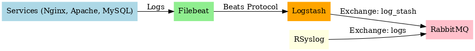

# 📦 Full Log Pipeline: RSyslog + Filebeat + Logstash + RabbitMQ

This project sets up a complete log pipeline using:

- 🔧 **RSyslog** – system log collector
- 🐰 **RabbitMQ** – message queue
- 🚀 **Logstash** – log processor
- 📤 **Filebeat** – log shipper

The pipeline collects logs from popular services like **Nginx**, **Apache**, and **MySQL**, and routes them either directly (via RSyslog) or through Filebeat → Logstash → RabbitMQ.

---

## 🧰 Prerequisites

Install all required dependencies:

```bash
sudo apt update && sudo apt install -y \
  build-essential autoconf automake libtool pkg-config git \
  libssl-dev librabbitmq-dev rsyslog \
  zlib1g-dev libgcrypt20-dev flex bison python3-pip \
  libestr-dev libfastjson-dev libczmq-dev python3-docutils
```

---

## 🖼️ Architecture Diagram



---

## 🔧 RSyslog with omrabbitmq Plugin

```bash
git clone https://github.com/rsyslog/rsyslog.git
cd rsyslog
cd contrib/omrabbitmq
sudo apt install build-essential autoconf automake libtool pkg-config libssl-dev librabbitmq-dev rsyslog
cd ../..
./autogen.sh
./configure
cd contrib/omrabbitmq
make
sudo make install
sudo cp /usr/local/lib/rsyslog/omrabbitmq.so /usr/lib/x86_64-linux-gnu/rsyslog/omrabbitmq.so
sudo chmod 644 /usr/lib/x86_64-linux-gnu/rsyslog/omrabbitmq.so
```

---

## ⚙️ RSyslog Configuration

Add this to `/etc/rsyslog.conf`:

```rsyslog
module(load="omrabbitmq")
action(type="omrabbitmq"
       server="localhost"
       port="5672"
       exchange="logs"
       exchange_type="direct"
       routing_key="rsyslog"
       user="guest"
       password="guest"
       vhost="/"
)
```

Restart:

```bash
sudo systemctl restart rsyslog
```

---

## 📤 Filebeat Installation & Configuration

```bash
curl -fsSL https://artifacts.elastic.co/GPG-KEY-elasticsearch | \
  sudo gpg --dearmor -o /usr/share/keyrings/elasticsearch-archive-keyring.gpg

echo "deb [signed-by=/usr/share/keyrings/elasticsearch-archive-keyring.gpg] https://artifacts.elastic.co/packages/8.x/apt stable main" | \
  sudo tee /etc/apt/sources.list.d/elastic-8.x.list

sudo apt-get update
sudo apt-get install filebeat
sudo systemctl enable filebeat
sudo systemctl start filebeat
```

Edit `/etc/filebeat/filebeat.yml`:

```yaml
filebeat.inputs:
- type: log
  enabled: true
  paths:
    - /var/log/nginx/access.log
    - /var/log/nginx/error.log
    - /var/log/apache2/access.log
    - /var/log/apache2/error.log
    - /var/log/mysql/error.log

- type: container
  enabled: true
  tags: ["docker"]
  paths:
    - /var/lib/docker/containers/*/*.json

output.logstash:
  hosts: ["localhost:5044"]
```

Test and restart:

```bash
sudo filebeat test config
sudo filebeat test output
sudo systemctl restart filebeat
journalctl -u filebeat -f
```

---

## 🪵 Install Logstash

```bash
sudo apt-get install logstash
```

Create `/etc/logstash/conf.d/beats-to-rabbitmq.conf`:

```conf
input {
  beats {
    port => 5044
  }
}

output {
  rabbitmq {
    host => "192.168.56.12"
    port => 5672
    user => "admin-user"
    password => "!Skfnj#$j djef)(!PFZt"
    vhost => "/"
    exchange => "log_stash"
    exchange_type => "topic"
    key => "central_logs_dev"
    durable => true
    persistent => true
  }
}
```

Run and validate:

```bash
sudo systemctl enable logstash
sudo systemctl start logstash
/usr/share/logstash/bin/logstash --config.test_and_exit -f /etc/logstash/conf.d/beats-to-rabbitmq.conf
journalctl -u logstash -f
```

---

## 🔁 Replacing Mail Logs with Common Logs

| Old Logs | Replaced With |
|----------|----------------|
| `/var/log/dpkg.log` | `/var/log/nginx/access.log` |
| `/var/log/kern.log` | `/var/log/apache2/access.log` |
| `/var/log/auth.log` | `/var/log/mysql/error.log` |

---

## ✅ Summary

| Component | Role |
|----------|------|
| **RSyslog** | Sends system logs to RabbitMQ |
| **Filebeat** | Collects logs and forwards to Logstash |
| **Logstash** | Parses logs and pushes to RabbitMQ |
| **RabbitMQ** | Central messaging queue |

---

## 🔐 Production Notes

- Change RabbitMQ default credentials
- Secure RabbitMQ and Logstash with TLS
- Monitor pipeline health with Prometheus & Grafana
- Use Docker containers for scaling the pipeline

---

## 📝 License

MIT License. Free to use and modify.
